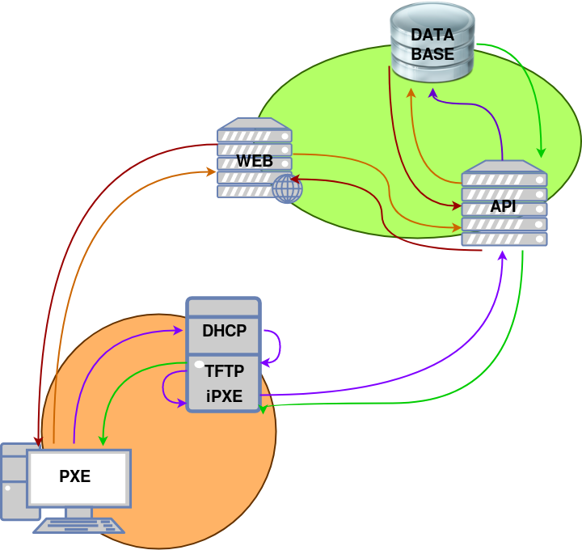

# PXE Cloud

PXE Cloud is a project that tries to create an easy to setup and easy to manage enviroment to boot live images and OS installers. Currently, you can boot both isos and initrd images.


## Getting Started

If you are interested in using this project, check out the [PXE Cloud Docker](https://github.com/pxe-cloud/pxe-cloud-docker) repository. There you have containers and Docker Compose definitions for both the **local server** (the server that is going to server the iPXE binary that is going to connect to the main server) and the **main server** (the server that is going to serve the API, the front-end and all the boot menus).


## How it works?

There's a diagram that shows all the process:

- **The red and orange path shows how the client manages the organizations, users, images, menus... through a web browser**. This front-end calls the API to make changes to the DB


- **The purple and green path shows the boot process**:
  - The user boots through the traditional PXE
  - The PXE requests an IP address to the DHCP server
  - The DHCP server sends back an address and sends the PXE to the TFTP server
  - The TFTP server returns the iPXE binary. The client boots this binary
  - The iPXE binary requests (again) an IP adress and calls automatically the API
  - The API responds with a login menu
    - The user sends the login credentials (if they are wrong, the API returns again the login menu)
  - The API responds with a list of all the organizations that the user is in (if it's just one, it jumps to the next step)
    - The user chooses an organization
  - The API responds with a list of all the groups inside the organization selected previously that the user is in (if it's just one, it jumps to the next step)
    - The user chooses a group
  - The API responds with the menu related with the organization
    - The user chooses an image (or action)
  - The iPXE boots the option that the user has chosen




## Code Structure

The code is separated in two big folders:

- `api`: The API folder is the folder that contains all the code related with the back-end of the project
- `website`: The website folder is the folder that contains all the code related with the front-end of the project


## Database Diagram

The database is structurated as the following:

```
 USERS
+------------------------------------------+
|                                          |
|  username    PK    string                |
|  password          string                |
|  email             string                |
|  organizations     array of strings (FK) +----+
|  groups            array of strings (FK) +----+----+
|                                          |    |    |
+------------------------------------------+    |    |
                                                |    |
 ORGANIZATIONS                                  |    |
+------------------------------------------+    |    |
|                                          |    |    |
|  id          PK    string                |<---+    |
|  name              string                |         |
|  description       string                |         |
|  groups            array of strings (FK) +----+    |
|                                          |    |    |
+------------------------------------------+    |    |
                                                |    |
 GROUPS                                         |    |
+--------------------------------+              |    |
|                                |              |    |
|  id          PK    string      |<-------------+----+
|  name              string      |
|  description       string      |
|  menu              sitrng (FK) +----+
|                                |    |
+--------------------------------+    |
                                      |
 MENUS                                |
+---------------------------+         |
|                           |         |
|  id          PK    string |<--------+
|  title             string |
|  background        string |
|  entries           array  |
|     type           string |
|       "image"             |
|       "separator"         |
|   * image_id FK    string +----------------------------------------------+
|   * content        string |                                              |
+---------------------------+                                              |
* If type is image, the field content isn't going to exist and viceversa    |
                                                                           |
 IMAGE                                                                     |
+---------------------------+                                              |
|                           |                                              |
| id           PK    string |<---------------------------------------------+
| title              string |
| type               string |
|     iso                   |
|     kernel_initrd         |
| kernel_source      string |
| image_source       string |
| boot_args          array  |
|                           |
+---------------------------+
```


## API Reference

For the API Reference, check out [https://pxecloud.docs.apiary.io](https://pxecloud.docs.apiary.io). The code of this API Blueprint documentation is at [docs/pxecloud.apib](docs/pxecloud.apib)


## Questions?

In case you need help or you have a question, just open an issue and we'll be happy to help you!


## Authors

- [Néfix Estrada Campañá](https://github.com/NefixEstrada)
- [Jorge Pastor](https://github.com/Jorgepastorr)


## License

This project is under a GNU General Public License v3.0. For more information, check [LICENSE](LICENSE)